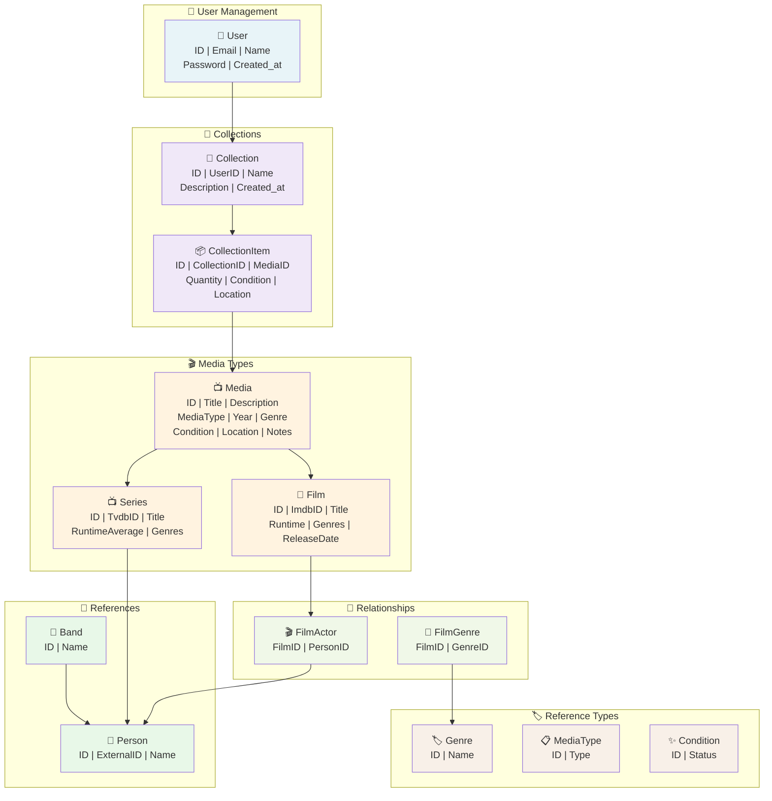

# 📊 FiMuVer Datenmodell

## Whiteboard Visualisierung

## Model-Übersicht nach Datei

| Datei | Model | Beschreibung |
|-------|-------|---|
| `media.go` | Media | Hauptmedien-Tabelle (Bluray, DVD, Vinyl, Tape) |
| `film.go` | Film, Series | Film- und Serien-Metadaten |
| `user.go` | User | Benutzer-Verwaltung |
| `collection.go` | Collection | Sammlungen von Benutzern |
| `collection_item.go` | CollectionItem | Einzelne Kopien in einer Sammlung |
| `person.go` | Person, Band | Personen (Regisseure, Schauspieler, Künstler) |
| `relationships.go` | FilmActor, FilmGenre | Many-to-Many Beziehungen |
| `reference_types.go` | Genre, MediaType, Condition | Referenztabellen |

## Datenbank-Constraints

- 🔑 **Primary Keys:** Alle Tabellen haben `id` als PK
- 🔗 **Foreign Keys:** CollectionItem → Media/Collection, FilmActor → Film/Person, etc.
- 📍 **Indexed:** `title`, `name`, `email` für schnelle Suche
- ⛔ **NOT NULL:** title, name (wo sinnvoll)

---

*Generiert: April 2026*

