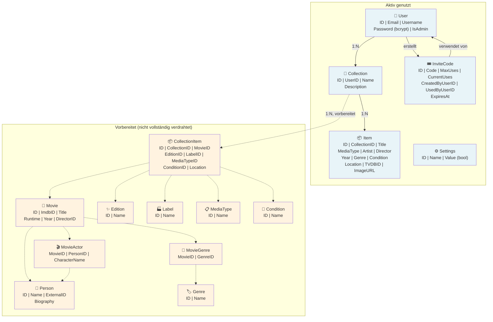

# 📊 FiMuVer Datenmodell

Es gibt zwei Ebenen im Schema:

1. **Aktiv über die API genutzt:** `User → Collection → Item` (flache Struktur, so wie das Frontend sie aktuell schreibt/liest), plus `InviteCode` und `Settings`.
2. **Vorbereitet, aber noch nicht vollständig verdrahtet:** ein normalisiertes Metadaten-Schema (`Movie`, `Person`, `Genre`, `Edition`, `Label`, `MediaType`, `Condition`, `CollectionItem`, `MovieActor`, `MovieGenre`). Alle Tabellen werden per GORM AutoMigration angelegt, aber nur `Edition` hat aktuell einen Read-Endpoint (`GET /api/v1/editions`).

## Diagramm

```mermaid
graph TB
    subgraph "Aktiv genutzt"
        User["👤 User<br/>ID | Email | Username<br/>Password (bcrypt) | IsAdmin"]
        Collection["📁 Collection<br/>ID | UserID | Name<br/>Description"]
        Item["📦 Item<br/>ID | CollectionID | Title<br/>MediaType | Artist | Director<br/>Year | Genre | Condition<br/>Location | TVDBID | ImageURL"]
        InviteCode["🎟️ InviteCode<br/>ID | Code | MaxUses | CurrentUses<br/>CreatedByUserID | UsedByUserID<br/>ExpiresAt"]
        Settings["⚙️ Settings<br/>ID | Name | Value (bool)"]
    end

    subgraph "Vorbereitet (nicht vollständig verdrahtet)"
        Movie["🎥 Movie<br/>ID | ImdbID | Title<br/>Runtime | Year | DirectorID"]
        Person["👤 Person<br/>ID | Name | ExternalID<br/>Biography"]
        Genre["🏷️ Genre<br/>ID | Name"]
        Edition["✨ Edition<br/>ID | Name"]
        Label["🏭 Label<br/>ID | Name"]
        MediaType["📋 MediaType<br/>ID | Name"]
        Condition["🔧 Condition<br/>ID | Name"]
        CollectionItem["📦 CollectionItem<br/>ID | CollectionID | MovieID<br/>EditionID | LabelID | MediaTypeID<br/>ConditionID | Location"]
        MovieActor["🎬 MovieActor<br/>MovieID | PersonID | CharacterName"]
        MovieGenre["🎥 MovieGenre<br/>MovieID | GenreID"]
    end

    User -->|1:N| Collection
    Collection -->|1:N| Item
    User -->|erstellt| InviteCode
    InviteCode -->|verwendet von| User

    Collection -.->|1:N, vorbereitet| CollectionItem
    CollectionItem -.-> Movie
    CollectionItem -.-> Edition
    CollectionItem -.-> Label
    CollectionItem -.-> MediaType
    CollectionItem -.-> Condition
    Movie -.-> Person
    Movie -.-> MovieActor
    MovieActor -.-> Person
    Movie -.-> MovieGenre
    MovieGenre -.-> Genre

    style User fill:#e8f4f8
    style Collection fill:#e8f4f8
    style Item fill:#e8f4f8
    style InviteCode fill:#e8f4f8
    style Settings fill:#e8f4f8
    style Movie fill:#fff3e0
    style Person fill:#fff3e0
    style Genre fill:#fff3e0
    style Edition fill:#fff3e0
    style Label fill:#fff3e0
    style MediaType fill:#fff3e0
    style Condition fill:#fff3e0
    style CollectionItem fill:#fff3e0
    style MovieActor fill:#fff3e0
    style MovieGenre fill:#fff3e0
```

Durchgezogene Pfeile = aktiv genutzter Pfad, gestrichelte Pfeile = vorbereitetes, noch nicht per API erreichbares Schema.

## Model-Übersicht nach Datei

| Datei | Model(s) | Status | Beschreibung |
|-------|----------|--------|---|
| `user.go` | User | ✅ aktiv | Benutzerkonto, bcrypt-Passwort-Hash, `is_admin`-Flag |
| `collection.go` | Collection | ✅ aktiv | Sammlung eines Users, hat mehrere Items |
| `item.go` | Item | ✅ aktiv | Flacher Medieneintrag innerhalb einer Collection (kein FK auf Movie/Genre etc.) |
| `invite_code.go` | InviteCode | ✅ aktiv | Einladungscode mit Nutzungslimit, Ablaufdatum, Ersteller/Verwender |
| `settings.go` | Settings | ✅ aktiv | Globale Boolean-Settings (z. B. `enable_registration`) |
| `media.go` | Media | ⚠️ unbenutzt | Älteres Model (Referenzen auf Person/Genre/MediaType/Condition), wird **nicht** in `db.InitializeDatabase` migriert und von keinem Handler verwendet — Altlast, Kandidat zum Entfernen |
| `movie.go` | Movie | 🚧 vorbereitet | Film-Metadaten (ImdbID, Titel, Regisseur-Referenz) |
| `person.go` | Person | 🚧 vorbereitet | Regisseure/Schauspieler |
| `relationships.go` | MovieActor, MovieGenre | 🚧 vorbereitet | Many-to-Many Beziehungen für Movie |
| `reference_types.go` | Genre, Edition, Label, MediaType, Condition | 🚧 vorbereitet (außer Edition: read-only via API) | Referenztabellen für das normalisierte Schema |
| `collection_item.go` | CollectionItem | 🚧 vorbereitet | Würde eine Collection mit einem Movie + Edition/Label/MediaType/Condition verknüpfen |

## Datenbank-Constraints

- 🔑 **Primary Keys:** Alle Tabellen haben `id` als PK (GORM `AUTO_INCREMENT`)
- 🔗 **Foreign Keys (aktiv genutzt):** `Collection.UserID → users.id`, `Item.CollectionID → collections.id`, `InviteCode.CreatedByUserID/UsedByUserID → users.id`
- 📍 **Unique/Indexed:** `users.email`, `users.username` (unique), `invite_codes.code` (unique), `collections.user_id` / `items.collection_id` (index)
- ⛔ **NOT NULL:** `users.email/username/password`, `collections.name`, `items.title`, `items.collection_id`
- 🔐 **Autorisierung:** Zugriff auf Collections/Items wird serverseitig gegen `user_id` aus dem JWT geprüft (siehe `handlers/collection.go`, `handlers/item.go`)

## AutoMigration-Reihenfolge

`db.InitializeDatabase` migriert in dieser Reihenfolge (Abhängigkeiten zuerst): `User → Person → Genre → Edition → Label → MediaType → Condition → Movie → MovieGenre → MovieActor → Collection → CollectionItem → Item → Settings → InviteCode`. Anschließend werden Default-Settings (`enable_registration`) und eine Default-Edition geseedet.

---

*Aktualisiert: September 2026*
